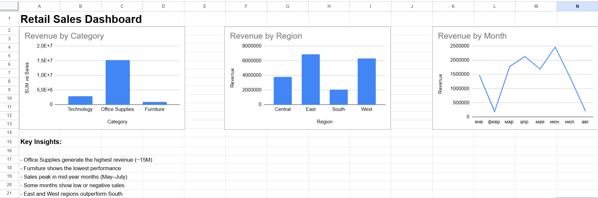

# Retail Sales Dashboard

## Overview
This project presents a sales analysis dashboard built in Google Sheets.  
It demonstrates data analysis skills using pivot tables, charts, and key Excel functions.

---

## Dashboard Preview

---

## Key Features
- Revenue analysis by Category, Region, and Month
- Interactive filtering using pivot tables
- Sales categorization using IF function
- Category mapping using VLOOKUP
- Clean and structured dashboard layout

---

## Tools Used
- Google Sheets
- Pivot Tables
- Charts (Bar & Line)
- VLOOKUP
- IF

---

## Key Insights
- Office Supplies generate the highest revenue (~15M)
- Furniture shows the lowest performance
- Sales peak in mid-year months (May–July)
- Some months show low or negative sales
- East and West regions outperform South
